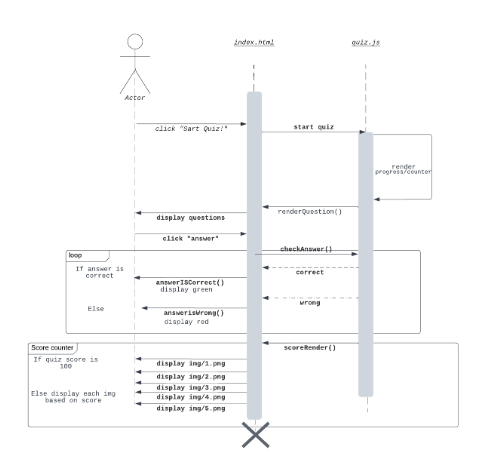

# TempleGuesser
A simple yet fun web application game that uses pictures of Temple University buildings, food trucks, and other outdoor places of interest, and requests a user to guess where they are on campus. Public map data will be shown to the player and the game will ask the player to guess their location. The location selection system will be an interactive map where players click on the coordinates they think the picture captures. Points will be accumulated for each location guess based on distance from the player’s location selection. After the player completes five location guesses, their score will be totaled and shown.

# Vision Statement
For people wanting to explore Temple's Main Campus virtually
who cannot immediately visit in-person or are exploring for fun.
TempleGuesser is a Web-based game that is free for everyone 
and provides an educational yet entertaining experience.
Unlike GeoGuessr and other Web-based location games,
our product has a smaller target audience which provides
a better quality service to those in need.

# High Level Requirement
This project is created from scratch and will allow users to open a web browser game on their local machine. Users will run a localhost server and run the files associated with the TempleGuesser project. On the webpage, users will be greeted with instructions of how to play the game. After clicking the “Play” button on the homepage, users will be directed to a webpage that shows them a 360° Google Street View image of a specific place on campus; however, unlike Google Street View, users will not be able to move around. Users will now guess the location they are at by dropping a pin on a mini map in the lower left-hand corner. Once a player submits their response, a new page will show the user how far away they were from the correction location. Points will be accumulated with a linear model depending on the distance between the user’s guess and the actual location of the street view photo. 

After the user reviews their results, they will be brought to another street view photo where they will repeat the same process. The user will repeat this process a total of five times where points are summed up at the end and shown to the user. Each street view photo shown within the five rounds will not be repeated. A database of around 25-50 street view pictures is needed for the user to not receive the same picture multiple times. Users will have a choice to replay the game with the same rules but different pictures as many times as they so choose. After multiple playthroughs, a user might experience some overlap of pictures. 

# Conceptual Design
The only hardware a user will need is a working computer that can open a web browser. Shown in the UML design below is a very basic idea to have the randomly generated pictures calculated in a separate class from the main program. Within the GoogleStreetView database, there will be 25-50 images of 360° view which will be used as the main functionality of the program. Inside this database, each image will be associated with a longitude and latitude. The TempleGuesser interface will hold a running total of the points earned, the number of rounds played, and the distance away from the database associated longitude and latitude. These fields and methods will be inherited by the TempleGuesserImpl class which will do the calculations. The only two additions in this class are roundGenerator() which picks a random database image for the round and a main method to run and debug. Other classes can be added in the future for additional functionalities such as different categories of locations, a different point system, and different rules when playing the game. 

# Background
TempleGuesser is very similar to web browser games such as GeoGuessr, PlayGeography, and City Guesser. All the listed web games show the user a picture of a geographical location and ask the user to select where they are in the world. However, TempleGuesser is unique in its selection of photos to identify. The database of photos will only be from Temple’s main campus whereas other websites have databases from all over the world. 
Below are the websites listed that were the inspiration for TempleGuesser…
-	https://www.geoguessr.com/
-	https://www.playgeography.com/
-	https://virtualvacation.us/guess


# Required Resources
In order to develop this project, a database of Temple University street view pictures will need to be acquired, as well as access to Google Maps for the player location selector feature. A basic understanding of how to us Google’s Map API and knowledge of how to code in HTML, CSS, and JavaScript, is needed as well.

A working Google Map API code is needed. Google Maps API requires a key which is a paid service. Accounts will only be charged only after $300 worth of credit. This project at its current stage would not exceed that limit and therefore not requiring students to pay for this service.

# Initial List of User Features
- As a commuter student I want to have a program to be played in the web-browser so that I can play at any time
- As a new faculty member I want to have a feature that holds database images of Temple's campus so I can explore lots of - different places
- As a parent of a university student I want a feature that allows database images to have 360 degree view so that I can view all around campus
- As an international student I want to have a feature that uses the Google Maps API to place pins so I can guess where the picture shown is
- As a math wiz I want a feature that can find the difference between two sets of coordinates so I can try and figure out the algorithm the page uses
- As a game junkie I want a feature that holds a personal scoreboard so I can compare my score with others
- As an individual with a sensitivity for light I want a feature that enables dark mode so I don’t have to strain my eyes

# Diagrams
 ## UML Class Diagram
  
 ## Sequence Diagrams
  
  - Sequence Diagram 1: Displaying correct or wrong answer feedback 
	This UML sequence diagram is displaying the functionality of our simple game “TempleGuesser”. The user begins on a welcome screen generated by the index.html. To start the game the user clicks “Start Quiz!”. A new screen appears with a counter, progress bar, image, and a list of answers. This is possible from the renderProgress(), renderCounter(), and renderQuestion() functions. The user must choose one of the choices to continue to the next question. Upon choosing one of the answers the two functions answerIsCorrect() and answerIsWrong() are used. They take in if the choice was correct and either pass a green circle or red circle to the screen based upon if the answer is correct or not. 

  
  - Sequence Diagram 2: Display of img based on score
	The process of playing the game remains the same, but this added functionality will provide feedback from the score earned. When the user answers each question their score is kept by the checkAnswer() function. If it determines the answer was correct it adds 1 to the score. Once all questions have been answered the scoreRender() function returns the user’s score and a correlating image. scoreRender() takes in the score count and converts it to a percentage, then determines the correct image to display based on the percentage. One image of a possible five will be displayed ranging from a red frowning face to a green smiley face.


# How to Build
Prerequisites:
- Mac/Windows/Linux 
- Google Maps API key with billing set-up
- VSCode version 1.63 or earlier
- Trello Board: https://trello.com/b/Nkg3W5V1/templeguesser

# Instructions:
## Part 1
- Test to see if ```localhost``` works in browser
- Create a folder in the file path ```C:\TempleGuesser\htdocs``` named "Test"
- Import the ```test.html``` in this repo into the file path ```C:\TempleGuesser\htdocs\Test```

## Part 2
> Google Maps API requires a key which is a paid service. Accounts will only be charged only after $300 worth of credit which re-sets each month. 
> This project at its current stage would not exceed that limit and therefore not requiring students to pay for this service.

- Import index.html & the js file into the same file path ```C:\TempleGuesser\htdocs\Test```
- Insert your API key on ```line 14``` of the ```index.html``` file

# How to Run and Test
## Part 1
- Open the ```localhost/Test/test.html``` server connection in your browser
- You should now see the string of text "Yay you did it!"

## Part 2
- Open the ```localhost/Test/``` server connection in your browser
- You should now see a Google Map image

# Debugging
- If you see nothing when opening ```index.html``` your Google API Key is not correct or your account is experiencing issues. 
Troubleshooting help: 
https://developers.google.com/maps/documentation/javascript/cloud-setup
https://www.youtube.com/watch?v=367oxHpnn_4&list=PLWnON6N0wn-EwVx4ZJNbmvC6quBgq5cif&index=5
